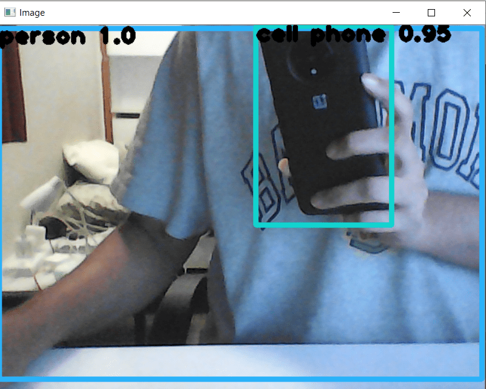

# yolo_object_detection
A Repository based on YOLOv3-spp weights for real-time Object Detection.

## Table of Contents
1. [ About. ](#about)
2. [ To Run. ](#run)
3. [ Additional Information. ](#info)
4. [ Sample Real-Time-Output. ](#op)
5. [ Contact Me. ](#contact)

# About This Repository
This is a repository based on YOLOv3-spp for real-time object detection.

# To Run Image Object Detection
1.  Open command line cmd at the root of the repository.
2.  Run the command
    - `python main.py`.
3. The image that has to send as input must be saved as `image.jpg` at root of folder.
4. The Marked Images is saved at root of folder as `marked_image.jpg`.

# To Run Real-Time Video Object Detection
1.  Open command line cmd at the root of the repository.
2.  Run the command
    - `python main_video.py`.
3. Video is taken from web camera.
4. Real Time Object Detection is shown on display.

# Additional Information

The Weights and Config Files are downloaded from [here](https://pjreddie.com/darknet/yolo/) and [here](https://github.com/pjreddie/darknet/blob/master/data/coco.names).
Store them Under `YOLO_data` Directory.

# Sample Real-Time-Output
A sample example is shown in :

.

# Contact Me
In case of error, feel free to contact us over Linkedin at [Adnan](https://www.linkedin.com/in/adnan-karol-aa1666179/) and [Niloy](https://www.linkedin.com/in/niloy-chakraborty/).